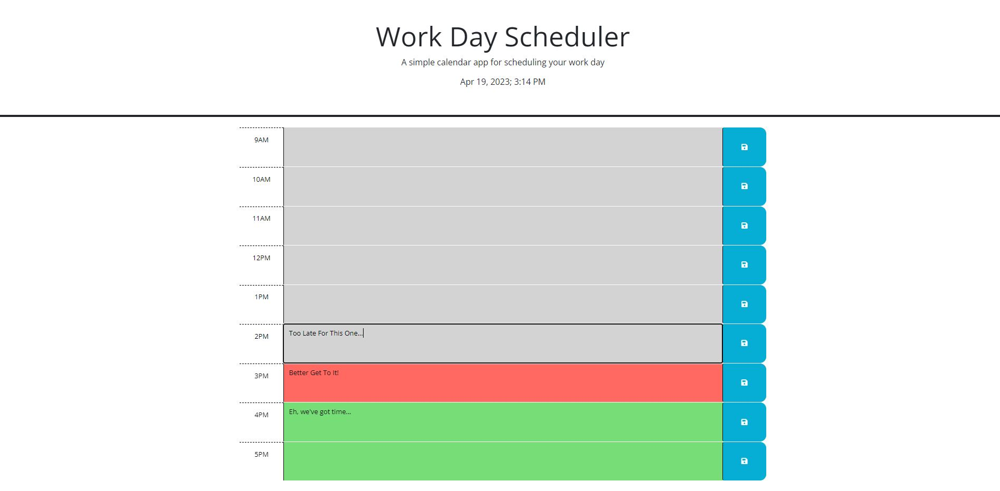

# Work Day Scheduler
  

  ## Table of Contents
  -[Description](#description)
  -[Installation](#installation)
  -[Usage](#usage)
  -[Contribute](#contribute)
  -[Tests](#tests)
  -[License](#license)
  -[Creator](#creator)

  ## Description
  In this project, my goal was to make an application that could be used to organize my work day. I could input my objectives for the day and as time passed, these objectives would then be highlighted in green for future objectives, red for current, and grey for past. In this project I learned a lot about how to properly use dayjs to format time as well as get a lot of practice in functions and for loops.

  ## Installation
  Nothing needs to be intalled.

  ## Usage
  Open the html file up in your browser first. From there you can type in your notes for the day. Everytime you refresh the page the note colors will update based on the current time displayed at the top of the page.

  This is how the application looks in your browser:
  

  ## Contribute
  Feel free to email me at the address down below.

  ## Tests
  Fork the repository and submit an issue.

  ## License
  Licensed under the following license: MIT

  ## Creator
  Thank you very much your your time. Feel free to take a look at my other projects at (https://github.com/provostma21).
  If you have any questions, you can also email me at provostmat@gmail.com.
